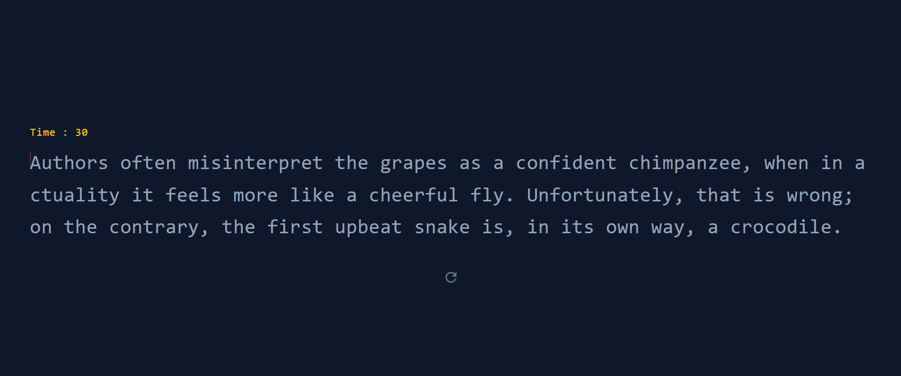

# TypeRush - Typing Speed Test

TypeRush is a minimalistic website designed to test your typing speed. It provides a simple and intuitive interface for users to practice and improve their typing skills.

## Features

- **Typing Speed Test**: Measure your typing speed by typing a given set of words or sentences within a specified time limit.
- **Accuracy Calculation**: Get instant feedback on your typing accuracy, including the number of correct and incorrect keystrokes.
- **Minalistic Design:** Focus on the typing task without distractions from unnecessary elements.
- **Error Highlighting:** Easily identify and correct typos with real-time error highlighting.

## Installation

To use TypeRush, simply visit the website [https://typerush.com](https://typerush.com) and start testing your typing speed right away. No installation or additional software is required.

## Usage

1. Visit the TypeRush website [https://typerush.com](https://typerush.com).
2. Choose the desired settings, such as time limit and difficulty level.
3. Click on the "Start" button to begin the typing speed test.
4. Type the given words or sentences as accurately and quickly as possible.
5. Once the time limit is reached, your typing speed and accuracy will be displayed.

## Contributing

Contributions to TypeRush are welcome! If you have any suggestions, bug reports, or feature requests, please submit them to our GitHub repository [https://github.com/typerush](https://github.com/Sumonta056/TypeRush-Typing-Speed-Test). We appreciate your feedback and contributions.

## License

TypeRush is released under the [MIT License](https://opensource.org/licenses/MIT). Feel free to use, modify, and distribute the code as per the terms of the license.
